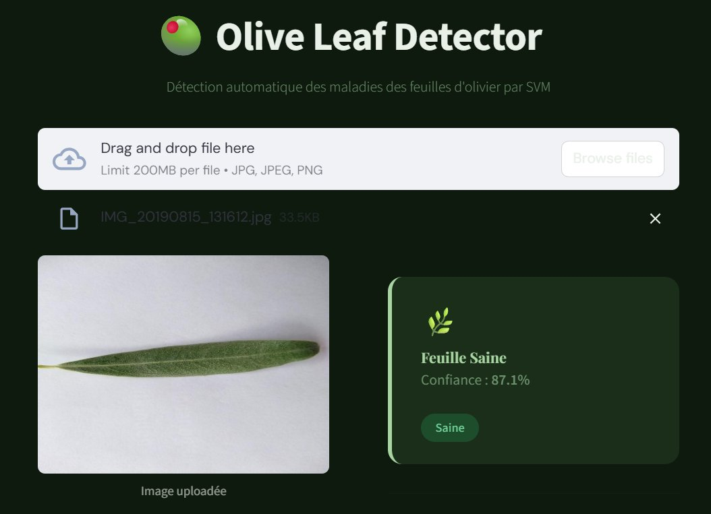
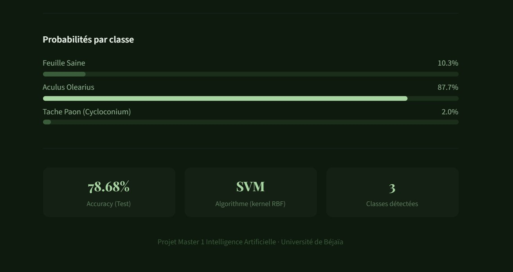
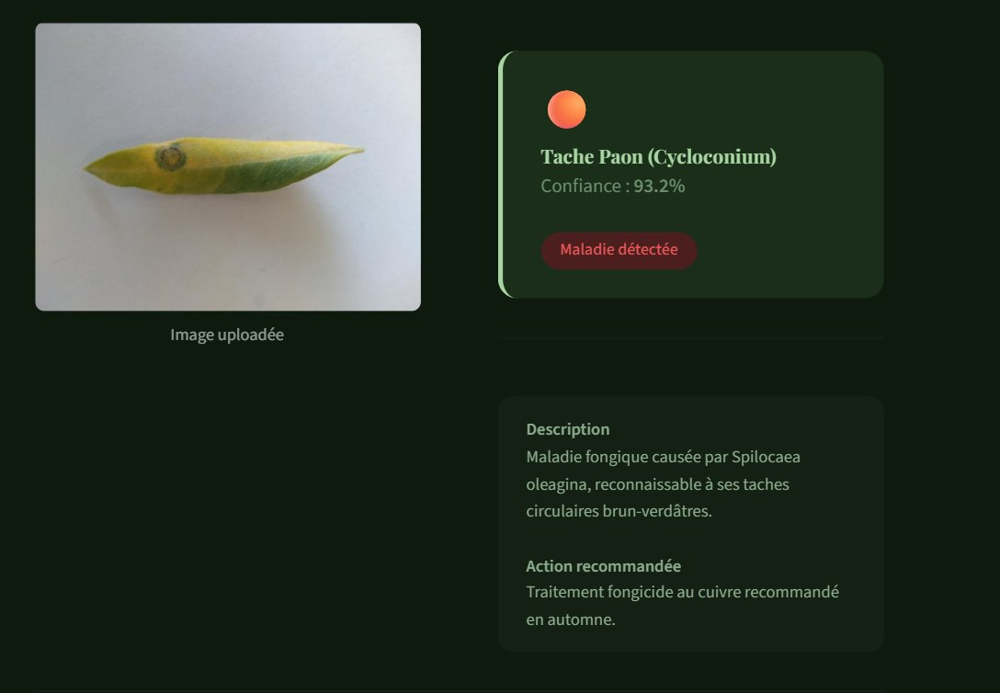
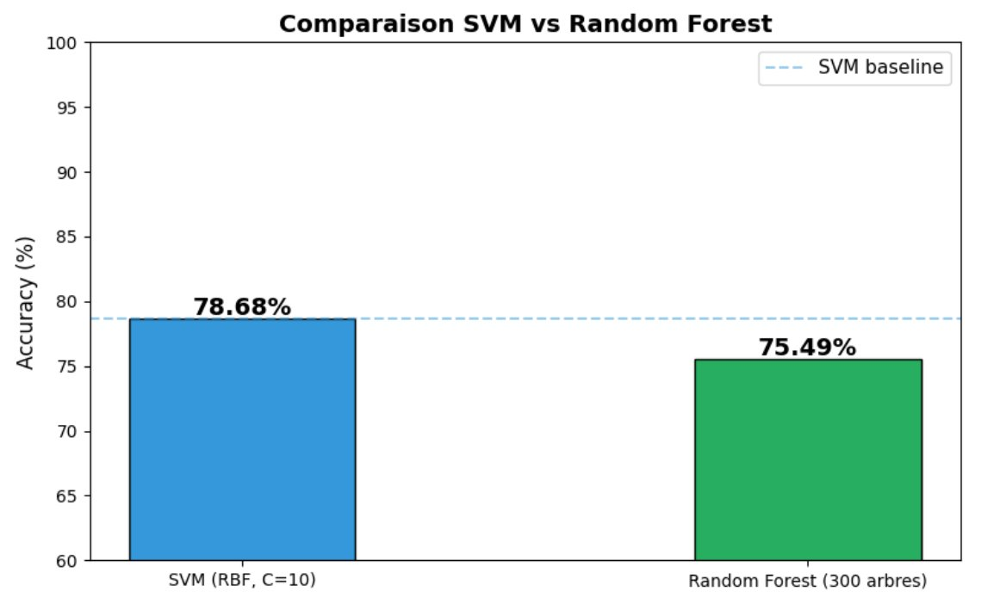
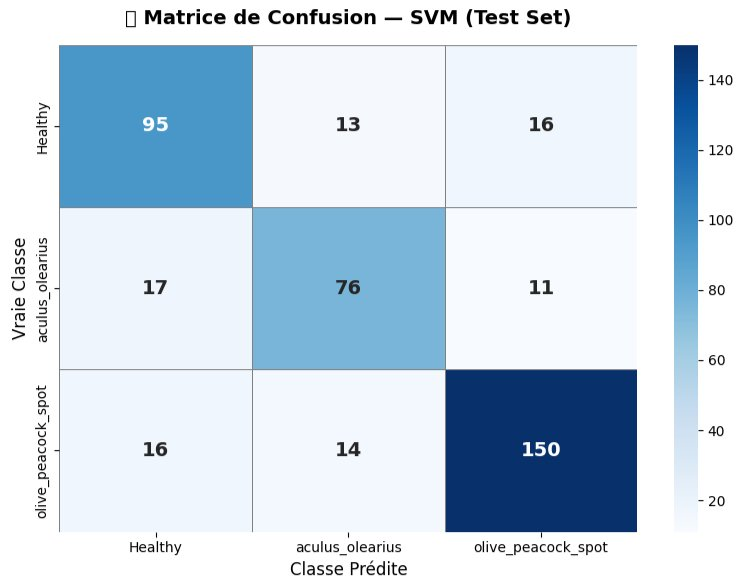
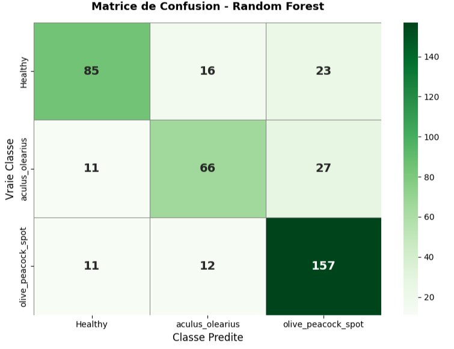
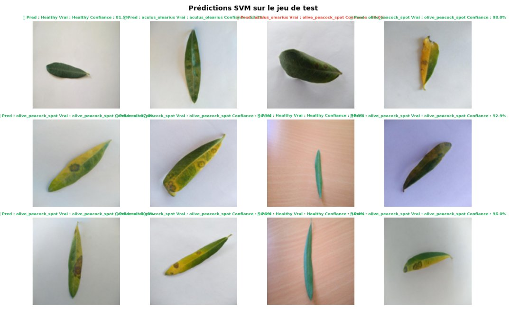

# 🫒 Olive Leaf Disease Detector

<div align="center">


**Automatic detection of olive leaf diseases using Machine Learning (SVM)**

[🚀 Live Demo](https://olive-leaf-detector-z9atjfjs4qiayuyraappin3.streamlit.app) · [📓 Notebook](olive_app/Olive_SVM_RF.ipynb) · [📊 Dataset](https://www.kaggle.com/datasets/vineethakkinapalli/olive-leaf-disease-dataset)

</div>

---

## 🖥️ Application

<div align="center">
<table>
<tr>
<td align="center" width="50%">

<b>Main Interface</b>
</td>
<td align="center" width="50%">

<b>Probability Scores</b>
</td>
</tr>
<tr>
<td align="center" width="50%">

<b>Aculus Olearius — 87.7%</b>
</td>
<td align="center" width="50%">

<b>Peacock Spot — 93.2%</b>
</td>
</tr>
</table>
</div>

---

## 📌 Overview

This project implements an **automatic classification system** for olive leaf diseases using classical Machine Learning algorithms. Given an image of an olive leaf, the system predicts whether the leaf is healthy or affected by one of two diseases.

Developed as part of the **Master 1 Artificial Intelligence** curriculum at the **University of Béjaïa, Algeria**.

---

## 🎯 Detected Classes

| Class | Description | Severity |
|-------|-------------|----------|
| 🌿 **Healthy** | No signs of disease | — |
| 🔴 **Aculus Olearius** | Microscopic mite infestation causing leaf deformation | High |
| 🟠 **Olive Peacock Spot** | Fungal disease (*Spilocaea oleagina*) with circular brown spots | Medium |

---

## 📊 Dataset

| Property | Value |
|----------|-------|
| Source | Kaggle — Olive Leaf Disease Dataset |
| Total images | 2,720 |
| Healthy | 830 images (30.5%) |
| Aculus Olearius | 690 images (25.4%) |
| Peacock Spot | 1,200 images (44.1%) |

---

## 🧠 Machine Learning Pipeline

```
Raw Images → Feature Extraction (64×64)
                ├── Pixels aplatis  → 12,288 features
                └── RGB Histogram   →    768 features
                                    ─────────────────
                               Total: 13,056 features
           → StandardScaler → SVM (kernel RBF, C=10) → Prediction
```

---

## 📈 Results & Confusion Matrices

<div align="center">
<table>
<tr>
<td align="center" width="40%">

| Algorithm | Accuracy |
|-----------|:--------:|
| **SVM (RBF, C=10)** | **78.68% ✅** |
| Random Forest (300) | 75.49% |



</td>
<td align="center" width="30%">

<b>SVM Confusion Matrix</b>
</td>
<td align="center" width="30%">

<b>RF Confusion Matrix</b>
</td>
</tr>
</table>



**SVM Predictions on Test Set**
</div>

---

## 🗂️ Project Structure

```
olive-leaf-detector/
├── olive_app/
│   ├── app.py                  # Streamlit web application
│   ├── requirements.txt        # Python dependencies
│   └── Olive_SVM_RF.ipynb      # Complete notebook (EDA + SVM + RF)
├── screenshots/                # Project screenshots
└── README.md
```

---

## 🚀 Run Locally

```bash
git clone https://github.com/Moumene21/olive-leaf-detector.git
cd olive-leaf-detector/olive_app
pip install -r requirements.txt
streamlit run app.py
```

> Models are automatically downloaded from Google Drive on first launch.

---

## 🛠️ Tech Stack

| Tool | Usage |
|------|-------|
| `scikit-learn 1.8.0` | SVM, Random Forest, preprocessing |
| `Streamlit` | Web interface |
| `NumPy / Pillow` | Feature extraction |
| `joblib / gdown` | Model serialization & download |
| `matplotlib / seaborn` | Visualization |

---

## 👤 Author

**Moumene** — Master 1 AI · University of Béjaïa, Algeria

[](https://github.com/Moumene21)

---
*MIT License*
